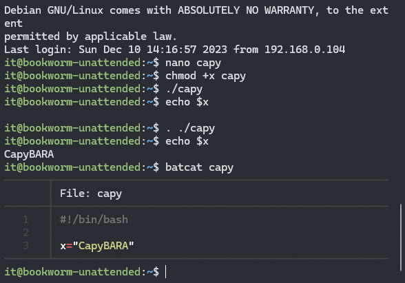
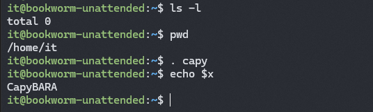
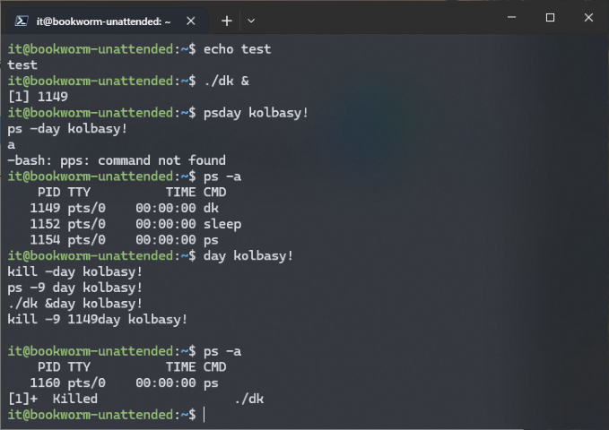
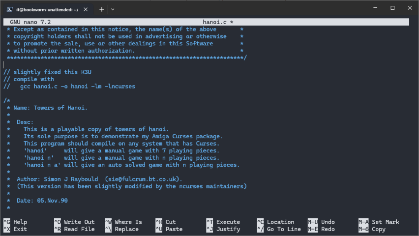
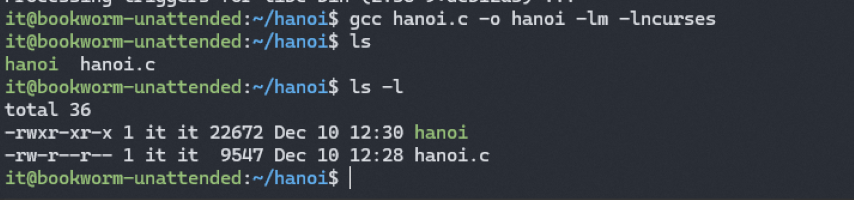
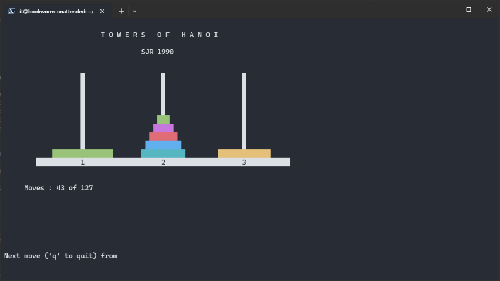

# \_Processes

> Read time: 4 min

- [\_Processes](#_processes)
  - [Intro](#intro)
  - [Prelude](#prelude)
  - [Создаем папку и добавляем в пути](#создаем-папку-и-добавляем-в-пути)
  - [Активируем изменения по логину](#активируем-изменения-по-логину)
  - [Колбасные дела](#колбасные-дела)
  - [Hanoi gcc](#hanoi-gcc)
  - [Finish:](#finish)

---
## Intro

<details open><summary>Вводные данные от Кирилла [Open]</summary>

|                                                                                    |                                                        |
| ---------------------------------------------------------------------------------- | ------------------------------------------------------ |
| Краткий экскурс от Кирилла по теме                                                 | [process-NBQ.html](_rsrc/process-NBQ.html)             |
| То же самое, только в Markdown                                                     | [process-NBQ.md](_rsrc/process-NBQ.md)                 |
| Про Daemon's                                                                       | [Youtube](https://www.youtube.com/watch?v=6-h6HtqPXNA) |
| Исходник ханойских башен у Крилла с сайте, <br> который нужно скомпилить через gcc | [hanoi tower](_rsrc/hanoi.c)                           |

</details>

> По заданию:
> - create folder /<имя>/  
> - add this folder into path  
> - activate changes with logout/login  
> - place into created folder script 'dai kolbasy'  
> - build hanoi towers game  
> 

Что, как и почему - я спрашивал у бота [Siin](_rsrc/proc_bot.md)


## Prelude

- Делаем если нема. Bat, highligh, apt-file - пригодятся в дальнейшем.  
  ```bash
  sudo apt update \
  && sudo apt upgrade -y \
  && sudo apt install gawk -y \
  && sudo apt install bat -y \
  && sudo apt install highlight -y \
  && sudo apt install apt-file -y \
  && sudo apt-file update
  ```
    
- Создаем скрипт который наглядно показывает различия между ./script и . ./script  
  `nano capy`

  ```bash
  #!/bin/bash

  x="CapyBARA"
  ```

- Чмодим и запускаем двумя способами и смотрим при каком из них нам возвращается значение   
`chmod +x capy`

  - first:  
  `./capy`  
  `echo $x`

  - second:  
  `. ./capy`   
  `echo $x `  

- Показываем капи на экран  
  `batcat capy`

- Output:  
  


## Создаем папку и добавляем в пути

- Сабж. Создаём папку Альпаки в корне и закидываем туда нашу Капибару.  
Нам понадобятся для этого рут права.  
`sudo mkdir /alpaca && sudo mv capy /alpaca`

- Добавляем в PATH нашего юзера путь к Альпаке  
`nano .profile`

  ```bash
  # set PATH so it includes user's private bin if it exists
  if [ -d "/alpaca" ] ; then
      PATH="/alpaca:$PATH"
  fi
  ```
- Показываем его на экран  
  `cat .profile | highlight -O ansi -S bash`


## Активируем изменения по логину

- Ищем Альпкаку в путях:  
  `echo $PATH`  
  `/usr/local/bin:/usr/bin:/bin:/usr/local/games:/usr/games`

- Альпаки нет, потому что файл запускается при логине. Выходим и заходим)
  `exit`  
  `ssh it@<ip>`

- Снова проверяем  
  `echo $PATH`  
  `/alpaca:/usr/local/bin:/usr/bin:/bin:/usr/local/games:/usr/games`

- Проверяем капибару (т.к папка PATH, то не нужно прописывать путь скрипту)  
  `. capy`  
  `echo $x`

- Альпака с капибарой на месте, всё ок.

  


## Колбасные дела

- Ты не ты, когда голоден ©  
  |                                                               |                                                            |
  | :-----------------------------------------------------------: | ---------------------------------------------------------- |
  |  |  |

- Создаем скрипт который каждые 3 сек будет требовать колбасу  
  `nano dk`

  ```bash
  #!/bin/bash
  while test 0
  do
  sleep 3
  echo day kolbasy!
  done
  ```

  `chmod +x dk`

- Показываем его на экран  
  `batcat dk`

- Запускаем c амперсандом, об отличиях можно найти опять же - [тут](_rsrc/proc_bot.md)  
  `./dk &`

- Начинает "требовать колбасу" - ищём PID процесса и убиваем  
  `ps -a`  
  `kill -9 <PID>`

  

P.S: можно и не искать по ps -a, PID запущенного процесса вывелся при запуске скрипта 
>[1] 1149


## Hanoi gcc

- Ищем gcc и ставим  
  `apt-file search gcc | grep -P '/bin/gcc$'`

  ```text
  it@bookworm-unattended:~/test$ apt-file search gcc | grep -P '/bin/gcc$'
  gcc: /usr/bin/gcc
  icecc: /usr/lib/icecc/bin/gcc
  pentium-builder: /usr/bin/gcc
  ```

  `sudo apt install gcc -y`

- Создаем каталог куда скинем исходник и где будем компилить.
  `mkdir hanoi`  
  `cd hanoi`  
  `nano hanoi.c`  

- Смотрим в исходник, видим короткую справку как компилить, и параметрам командной строки самой игры.

  

- Компилим.... нет, не компилим  
  `gcc hanoi.c -o hanoi -lm -lncurses`

  ```bash
  it@bookworm-unattended:~/test$ gcc hanoi.c -o hanoi -lm -lncurses
  hanoi.c:54:10: fatal error: ncurses.h: No such file or directory
    54 | #include <ncurses.h>
        |          ^~~~~~~~~~~
  compilation terminated.
  ```

- Нам не хватает библиотеки ncurses, ищем и ставим её вообщем  
  `apt-file search ncurses | grep -P '/bin'`   

  ```text
  it@bookworm-unattended:~/test$ apt-file search ncurses | grep -P '/bin'
  libncurses-dev: /usr/bin/ncurses5-config
  libncurses-dev: /usr/bin/ncurses6-config
  libncurses-dev: /usr/bin/ncursesw5-config
  libncurses-dev: /usr/bin/ncursesw6-config
  ``` 
  
  `sudo apt install libncurses-dev -y`

- Пробуем скомпилить снова, на этот раз удачно.  Сморим и запускаем, играем. 
  `gcc hanoi.c -o hanoi -lm -lncurses`  
  `ls -l`  
  
    
  `./hanoi`  


## Finish:

- Насколько хватило терпения xD
  

_
- [Sesstion](_rsrc/session.html) or [WEB](https://xprgclr.github.io/tpt/proc/)
- [history](_rsrc/history.txt)
